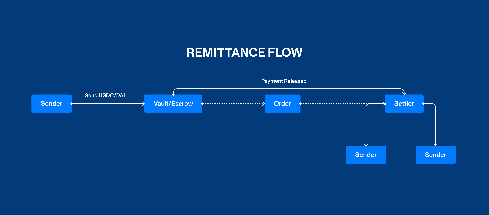

---

#### Radenu is a decentralized, non-custodial P2P remittance payment protocol. Radenu implements a unique, on-chain escrow P2P payment solution analogous to commonly understood P2P applications like Binance, but transactions are completely pseudonymous. 
Web: Visit [https://radenu.vercel.app](https://radenu.vercel.app/). 

---


#### 👨‍💻 The Core Architecture
- The Vault/Escrow
- The Sender
- The Settler
- The Receiver

The Vault: This is the key infrastructure of the network which holds funds and acts as an escrow on the platform. The Vault is built on smart contracts that execute when all conditions for the settlement are met.

The Sender: This is the user that initiates the remittance transaction (transfer) via a cryptocurrency payment and he/she is responsible for providing the details of the receiver in the form of a local bank account (fiat currency).

The Settler: This is the user that actually deposits the fiat currency to the receiver, the settler is usually resident in the receiver’s country OR can perform funds (fiat) transfer to the receiver’s local bank account.

The Receiver: This is the recipient of the fiat payment and they do not need to be on the platform, however, they can communicate with the Sender offline to acknowledge receipt of funds to their local bank account.



#### Modus Operandi 
The sender initiates a cryptocurrency transaction indicating his/her intention to send money to a recipient in a supported jurisdiction, providing all the local bank account details of the receiver. The sender sends the stablecoin equivalent to a vault.
For example, a sender transfers $1000 in stablecoins such as DAI, USDT, and USDC to the Vault/Escrow, and also provides the receiver’s details. The transfer advert (order) is then published and can be fulfilled by a Settler.
The Settler picks up a transfer advert and accepts to complete the payment in the receiver’s local currency/fiat. The settlements are to be fulfilled in a 45 minutes window timeframe to give room for all necessary transactions to be carried out. Once a Settler accepts to fulfill an order, that order is frozen.
Once the Settler has fulfilled the payment in the local fiat currency, they can mark the order as completed and this generates a notification to the Sender to authorize the Vault to release payment. The Sender can communicate with the Receiver off our platform to ascertain that payment was received. In the event that payment was received the Sender can authorize the release of the payment to the Settler concluding the full cycle of the payment process. If both the Sender and Settler cannot agree that the order transaction was completed successfully, either party can open a dispute claim which triggers an arbitration process.

#### Fees, Revenues, and Incentives
The platform generates fees from a 0.2% charge on the total amount to be sent, which serves as revenue to the protocol and is stored in the vault.
The Settler makes a profit from the differences in the exchange rate that is fixed or agreed upon by the platform.
Transaction points (XP) are introduced on the platform to help incentivize user behavior and bootstrap network effects. These points (XP) may be used to incentivize early users in various 

Run:

```shell
npx hardhat test
npx hardhat node
npx hardhat run scripts/deploy.js
```
